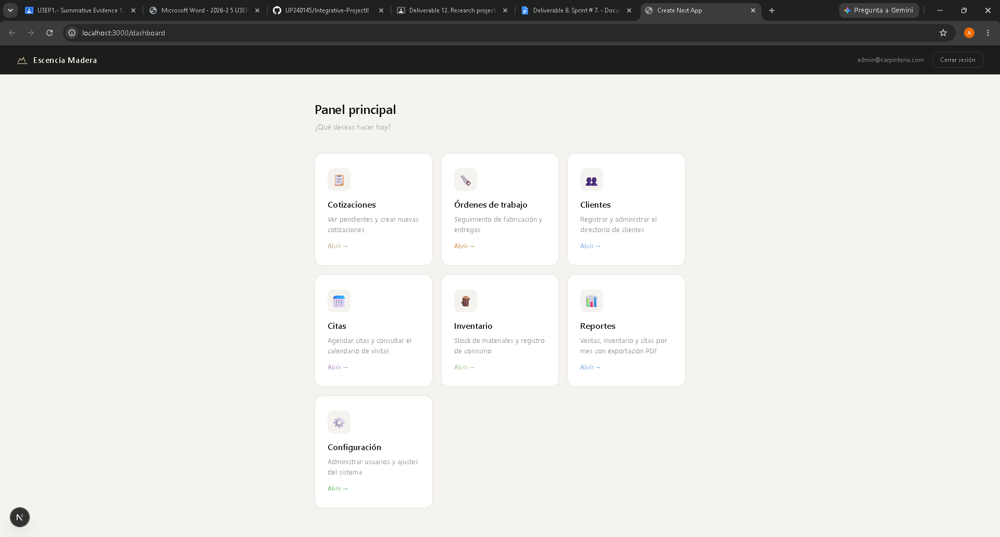
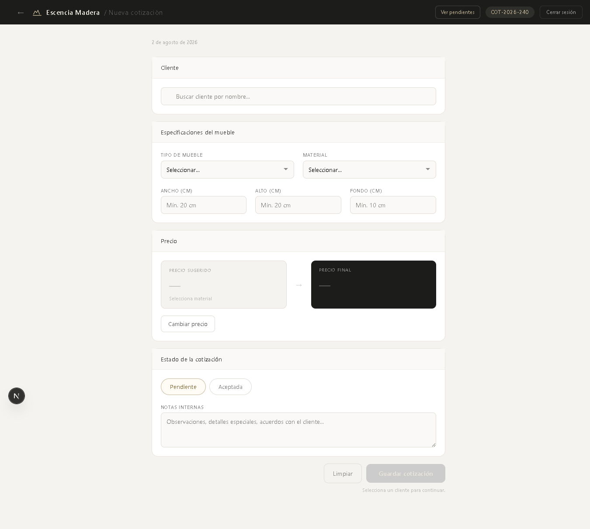

# Sistema Esencia Madera - Frontend / Interfaz de Usuario

## Descripción
Interfaz de usuario para el Sistema Esencia Madera desarrollada con Expo y React Native. Permite la navegación fluida por parte del administrador para la gestión de clientes, generación de cotizaciones a medida, control de inventario de maderas, citas y reportes del negocio.

---

## 1. Código Fuente y Estructura
El código fuente de este módulo se encuentra estructurado en el repositorio excluyendo las carpetas pesadas o innecesarias (`node_modules`, `dist` o cachés de compilación), conservando únicamente los componentes, pantallas y archivos de configuración esenciales.

---

## 2. Capturas de Pantalla de la Interfaz en Ejecución
Pagina Principal

Generacion de cotizaciones


---

## 3. Librerías y Dependencias Empleadas
El proyecto móvil utiliza las siguientes librerías y herramientas principales:
* **`expo`**: Plataforma y framework para la creación y ejecución rápida de aplicaciones multiplataforma.
* **`react`** / **`react-native`**: Biblioteca base para la construcción de interfaces de usuario mediante componentes nativos.
* **`react-navigation`**: Manejo de rutas, navegación y flujo entre las pantallas de la aplicación.
* **`axios`** o **`fetch`**: Comunicación HTTP para la integración con los endpoints del backend y la API REST.

---

## 4. Comandos de Instalación y Ejecución

### Instalación de dependencias
Ejecuta el siguiente comando en la terminal dentro de la carpeta del frontend:
```bash
npm install